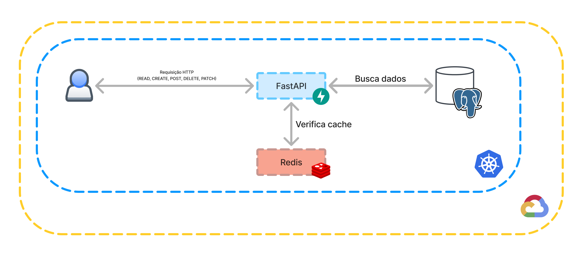

# Documentação do Projeto

# Visão Geral

Este projeto FastAPI é voltado para um teste técnico da Montseguro Corretora e inclui um microsserviço de To Do List.

- Documentação da API: [http://35.238.205.137/docs](http://35.238.205.137/docs)

# Arquitetura

A arquitetura do projeto é baseada em uma abordagem moderna e escalável. O back-end é desenvolvido com FastAPI, proporcionando uma API de alto desempenho e rápida. O Redis é utilizado para caching de requisições, otimizando a performance e reduzindo o tempo de resposta. A aplicação é conteinerizada com Docker, permitindo uma implantação consistente em diferentes ambientes, e gerenciada com Docker Compose durante o desenvolvimento para facilitar a configuração e execução de múltiplos containers. Para a orquestração em produção, utiliza-se Kubernetes, garantindo escalabilidade e gerenciamento eficiente dos containers. O PostgreSQL é executado localmente em um container Docker, oferecendo uma base de dados robusta e confiável. Para deploy do microsserviço foi utilizada uma VM do Google Cloud Platform.

A CI/CD do projeto utiliza o GitHub Actions para automatizar o processo de teste e verificação de estilo do código. A configuração do GitHub Actions garante que, a cada push para o repositório, os testes unitários e de integração sejam executados, e que o código seja verificado quanto ao estilo utilizando o Flake8 para garantir a conformidade com o padrão PEP 8.

## Diagrama de Arquitetura do Sistema



# Instalação

## 1. Instalação do Git

```bash
sudo apt install git
```

## 2. Clonando o Repositório

```bash
git clone https://github.com/LeudoNeto/to-do-list.git
cd to-do-list/
```

## 3. Instalação do Docker e Docker Compose


```bash
sudo apt install docker
sudo apt install docker-compose
```

Adicione seu usuário ao grupo Docker para evitar a necessidade de usar `sudo` para executar comandos Docker:

```bash
sudo usermod -aG docker $USER
```

**Observação:** Pode ser necessário reiniciar a sessão ou o sistema para que as alterações no grupo tenham efeito.

## 4. Instalação do Minikube e kubectl

Atualize a lista de pacotes e instale ferramentas essenciais:

```bash
sudo apt-get update
sudo apt-get install -y curl apt-transport-https
```

Baixe e instale o Minikube, uma ferramenta para executar clusters Kubernetes localmente:

```bash
curl -LO https://storage.googleapis.com/minikube/releases/latest/minikube-linux-amd64
chmod +x minikube-linux-amd64
sudo mv minikube-linux-amd64 /usr/local/bin/minikube
```

Baixe e instale o `kubectl`, a ferramenta de linha de comando para interagir com clusters Kubernetes:

```bash
curl -LO "https://dl.k8s.io/release/$(curl -s https://storage.googleapis.com/kubernetes-release/release/stable.txt)/bin/linux/amd64/kubectl"
chmod +x kubectl
sudo mv kubectl /usr/local/bin/
```

# Execução

## 1. Para Desenvolvimento (com Docker Compose)

```bash
./run_dev.sh
```

## 2. Para Produção (com Kubernetes)

Inicie o Minikube, que configura o cluster Kubernetes local:

```bash
minikube start
```

Execute o script `run_prod.sh` para iniciar os serviços no ambiente de produção:

```bash
./run_prod.sh
```

Aguarde alguns instantes enquanto o serviço FastAPI inicia. Para verificar os pods em execução:

```bash
kubectl get pods
```

Para acessar o serviço FastAPI, use um dos métodos abaixo:

- **Método 1:** Obtenha a URL do serviço com o comando:

    ```bash
    minikube service fastapi --url
    ```

    Exemplo de onde o serviço estará disponível: [http://192.168.49.2:31092](http://192.168.49.2:31092).

- **Método 2:** Configure o port-forwarding para acessar o serviço localmente:

    ```bash
    kubectl port-forward service/fastapi 8000:8000
    ```

    Acesse o serviço em [http://127.0.0.1:8000](http://127.0.0.1:8000).

# Estrutura do Projeto

- **`api/`**
  - **`main.py`**: Arquivo principal que inicializa a aplicação FastAPI e inclui a configuração de roteamento e middlewares.
  - **`dependencies.py`**: Contém dependências e injeções de dependência utilizadas em vários endpoints da API.
  - **`crud/`**:
    - **`tasks.py`**: Implementa operações de CRUD para a entidade `tasks`, incluindo criação, leitura, atualização e exclusão.
  - **`models/`**:
    - **`tasks.py`**: Define o modelo de dados para a entidade `tasks`, mapeando a estrutura do banco de dados.
  - **`routers/`**:
    - **`tasks.py`**: Contém os endpoints da API relacionados à entidade `tasks`, organizados em rotas.
  - **`schemas/`**:
    - **`tasks.py`**: Define os esquemas Pydantic para validação e serialização de dados da entidade `tasks`.
  - **`utils/`**:
    - **`redis_cache.py`**: Implementa utilitários para interagir com o Redis e gerenciar o cache de requisições.

- **`k8s/`**
  - **`configmap.yaml`**: Configura mapas de configuração para armazenar dados não confidenciais usados pela aplicação.
  - **`db-deployment.yaml`**: Define o deployment para o container do PostgreSQL, especificando como o banco de dados deve ser executado.
  - **`db-service.yaml`**: Define o serviço Kubernetes para expor o PostgreSQL internamente no cluster.
  - **`fastapi-deployment.yaml`**: Configura o deployment para a aplicação FastAPI, incluindo o número de réplicas e configurações do container.
  - **`fastapi-service.yaml`**: Define o serviço Kubernetes para expor a aplicação FastAPI, permitindo o acesso externo.
  - **`redis-deployment.yaml`**: Define o deployment para o container do Redis, especificando como o cache deve ser executado.
  - **`redis-service.yaml`**: Define o serviço Kubernetes para expor o Redis internamente no cluster.
  - **`secret.yaml`**: Configura os segredos necessários para a aplicação, como credenciais e variáveis de ambiente sensíveis.

- **`tests/`**
  - **`test_crud.py`**: Contém testes unitários para as operações de CRUD implementadas na aplicação.
  - **`test_integration.py`**: Contém testes de integração para verificar a interação entre diferentes componentes da aplicação.

- **`.env`**: Arquivo de configuração de variáveis de ambiente usadas pela aplicação e containers.
- **`.flake8`**: Configuração para o linter Flake8, que verifica o estilo do código Python.
- **`docker-compose.yml`**: Define e configura os serviços Docker necessários para o desenvolvimento, incluindo FastAPI, Redis e PostgreSQL.
- **`Dockerfile`**: Especifica as instruções para construir a imagem Docker para a aplicação FastAPI.
- **`pytest.ini`**: Configuração para o pytest, especificando opções de teste e diretórios de teste.
- **`requirements.txt`**: Lista as dependências Python necessárias para a aplicação FastAPI.
- **`run_dev.sh`**: Script para iniciar a aplicação e serviços em um ambiente de desenvolvimento.
- **`run_prod.sh`**: Script para iniciar a aplicação e serviços em um ambiente de produção.
